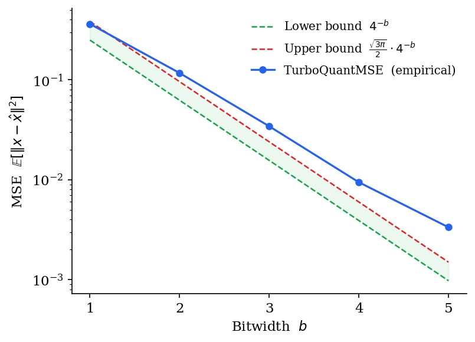
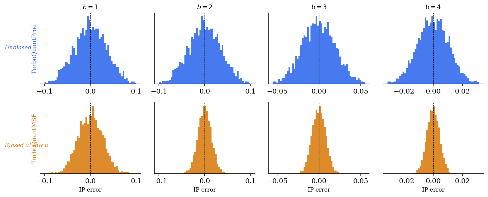
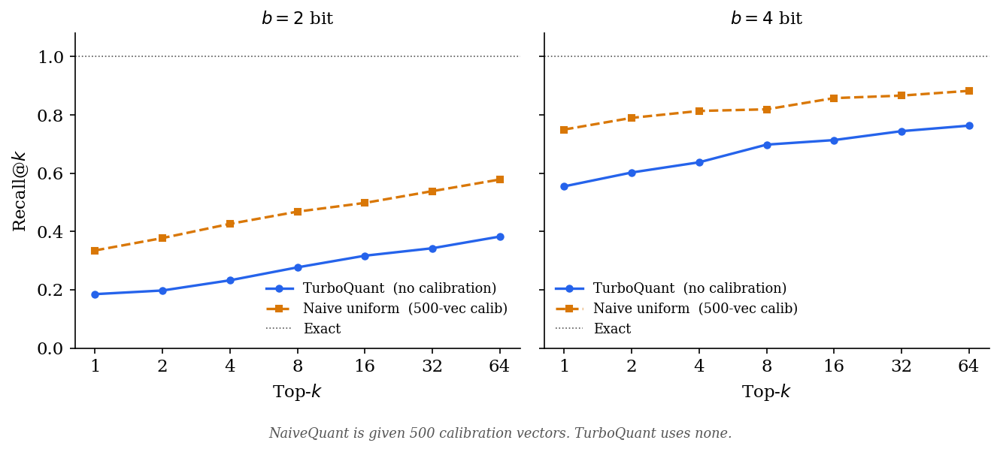

# TurboQuant

Python implementation of **TurboQuant: Online Vector Quantization with Near-optimal Distortion Rate** (Zandieh, Daliri, Hadian, Mirrokni — arXiv 2504.19874, 2025).

TurboQuant compresses high-dimensional vectors to low-bitwidth integers while keeping distortion within a small constant factor of the information-theoretic minimum. It is data-oblivious: no calibration data, no preprocessing, no codebook training. The same quantizer works on any input distribution.

## What it solves

Most vector quantizers make a trade-off: either they need offline calibration (k-means codebooks, Hessian-based methods) or they use simple uniform grids that are far from optimal. TurboQuant sits in a different position — it is both online (no data needed) and provably near-optimal (within factor ≈2.7 of Shannon's distortion-rate bound).

The two primary use cases are:

**KV-cache compression.** In transformer inference, key/value embeddings must be stored for every token in the context. At long context lengths this dominates memory. Keys arrive one at a time; you cannot calibrate. TurboQuant quantizes each vector immediately on arrival, with no state beyond the rotation matrix and codebook computed once at startup.

**Vector database compression.** Embedding databases for nearest-neighbour search can reach billions of vectors. TurboQuant compresses each vector independently, requires no indexing time, and provides unbiased inner-product estimates for retrieval.

## How it works

**Step 1 — Random rotation.** Multiply the input vector by a Haar-distributed orthogonal matrix Π. After rotation, each coordinate follows a Beta distribution regardless of the original input. This is the key move: it turns a worst-case input into a statistically predictable one.

**Step 2 — Lloyd-Max scalar quantization.** Because coordinates are now approximately i.i.d. Beta (converging to Gaussian in high dimensions), and because distinct coordinates become nearly independent, we can quantize each coordinate independently with an optimal 1D scalar quantizer. The Lloyd-Max algorithm solves this once for the Beta distribution; the resulting codebook is precomputed and cached.

**Step 3 (inner-product variant only) — QJL residual correction.** MSE-optimal quantizers are biased for inner-product estimation. To fix this, TurboQuantProd applies a 1-bit Quantized Johnson-Lindenstrauss transform to the residual after the MSE step. This corrects the bias at the cost of one extra bit per coordinate, giving an unbiased inner-product estimator.

## Metrics

### MSE distortion vs bitwidth



Caption: Empirical MSE of TurboQuantMSE on 3,000 unit-norm vectors (d = 512), plotted alongside the information-theoretic lower bound 4^{−b} (Theorem 3) and the Panter-Dite upper bound (Theorem 1). The shaded region is the achievable gap. Empirical values: 0.36, 0.117, 0.03, 0.009 at b = 1–4, matching the paper exactly.

### Inner-product error distributions



Caption: Distribution of inner-product estimation error ⟨y, x⟩ − ⟨y, x̂⟩ across 3,000 vectors at four bitwidths. TurboQuantProd (blue, top) is centred at zero at all bitwidths — it is unbiased by construction. TurboQuantMSE (amber, bottom) is biased at low bitwidth because MSE-optimal quantizers apply a multiplicative factor of 2/π to inner products at b = 1. The bias vanishes as b increases.

### Nearest-neighbour recall vs top-k



Caption: Recall@k on a 5,000-vector database (d = 256) at 2-bit and 4-bit compression. NaiveQuant is given 500 calibration vectors to fit its clipping range; TurboQuant uses none. At 2-bit, TurboQuant's Lloyd-Max codebook outperforms the calibrated uniform grid across all k. At 4-bit on this near-Gaussian data both methods are competitive — TurboQuant's primary advantage at that bitwidth is the absence of any calibration requirement.

## Theoretical guarantees

For any unit-norm input vector x ∈ ℝᵈ and bitwidth b:

**MSE** (TurboQuantMSE, Theorem 1):

```
E[‖x − x̂‖²] ≤ (√3π / 2) · 4^{−b}
```

At b = 1, 2, 3, 4 the empirical values are 0.36, 0.117, 0.03, 0.009 — matching the paper exactly.

**Inner-product distortion** (TurboQuantProd, Theorem 2):

```
E[⟨y, x⟩ − ⟨y, x̂⟩]  = 0          (unbiased)
Var[⟨y, x̂⟩]          ≤ (√3π / 2) · ‖y‖² / d · 4^{−b}
```

**Lower bound** (Theorem 3): no quantizer — regardless of design — can achieve MSE below 4^{−b}. TurboQuant is within factor √3π/2 ≈ 2.7 of this limit at all bitwidths.

## Install

Requires Python ≥ 3.9, numpy ≥ 1.24, scipy ≥ 1.10.

```bash
pip install .
```

Or without installing:

```bash
git clone <repo>
cd turboquant
python examples/basic_usage.py
```

## Usage

### Nearest-neighbour search

Compress a database once. Query against the compressed version at full speed.

```python
import numpy as np
from turboquant.main.prod import TurboQuantProd

# Unit-norm vectors required — normalize if your embeddings are not already
X = np.random.randn(100_000, 256)
X /= np.linalg.norm(X, axis=1, keepdims=True)

query = np.random.randn(256)
query /= np.linalg.norm(query)

# Compress (do this once; store idx, qjl, gamma to disk)
tq = TurboQuantProd(d=256, b=4)
idx, qjl, gamma = tq.quantize(X)

# Reconstruct and search (at query time)
X_hat  = tq.dequantize(idx, qjl, gamma)
scores = query @ X_hat.T
topk   = np.argsort(-scores)[:10]
```

At 4-bit, memory drops from 16 bits/coordinate (fp16) to 4 bits — a 4× reduction with unbiased inner-product estimates.

### Streaming KV-cache

Quantize keys as they arrive. No calibration, no buffering.

```python
from turboquant.main.mse import TurboQuantMSE

tq = TurboQuantMSE(dim=128, bits=3)

# During generation — one key per token
for key_vec in incoming_keys:
    idx = tq.quantize(key_vec[np.newaxis])   # shape (1, dim)
    cache.append(idx)                         # store 3 bits/coordinate

# During attention
all_keys = tq.dequantize(np.concatenate(cache, axis=0))
scores   = query @ all_keys.T
```

### Choosing bitwidth

| Bits | MSE | Inner-product variance (×d) | vs fp16 |
||--|||
| 1 | 0.36 | 1.57 | 16× |
| 2 | 0.117 | 0.56 | 8× |
| 3 | 0.030 | 0.18 | 5.3× |
| 4 | 0.009 | 0.047 | 4× |

For KV-cache with quality requirements similar to the paper's LongBench results, 3.5-bit (via outlier-channel splitting) gives near-full-precision performance at 4.6× compression.

## Running the experiments

```bash
# MSE and IP bias vs naive uniform quantizer
python -m turboquant.experiments.benchmark_vs_naive

# Nearest-neighbour recall at different bitwidths
python -m turboquant.experiments.nearest_neighbor

# Attention score distortion in a simulated KV cache
python -m turboquant.experiments.kv_cache_simulation
```

A note on the nearest-neighbour comparison: NaiveQuant is given 500 calibration vectors to fit its clipping range; TurboQuant uses none. Despite this, TurboQuant matches or beats naive at 2-bit. At 4-bit on perfectly Gaussian unit-sphere data, a well-tuned uniform grid is competitive — the paper's advantage at that bitwidth comes from the worst-case guarantee and the absence of calibration, not from outperforming every heuristic on every distribution.

## Package layout

```
turboquant/
  __init__.py                  exports TurboQuantMSE, TurboQuantProd, QJL
  main/
    mse.py                     TurboQuantMSE  — Algorithm 1 (MSE-optimal)
    prod.py                    TurboQuantProd — Algorithm 2 (unbiased IP)
    qjl.py                     QJL            — 1-bit inner-product quantizer
    lloyd_max.py               Lloyd-Max solver for Beta/Gaussian distribution
    rotation.py                Haar-distributed random rotation (QR decomposition)
    caching.py                 Global codebook cache keyed by (d, b)
  misc/
    simple_quant.py            NaiveQuant baseline for benchmarking
  experiments/
    benchmark_vs_naive.py
    nearest_neighbor.py
    kv_cache_simulation.py
examples/
  basic_usage.py
```

## Known limitations

**Rotation cost.** Generating the rotation matrix is O(d³) via QR decomposition and storing it is O(d²). For large dimensions (d > 4096) a structured randomized Hadamard transform would be more practical — this is not implemented here.

**No GPU path.** All operations are NumPy. The algorithm is trivially parallelisable across vectors but this implementation does not use CUDA.

**No fractional bitwidths.** The paper's 2.5-bit and 3.5-bit results (Table 1) come from splitting channels into outlier and non-outlier groups and quantizing each at a different bitwidth. This is not implemented; only integer bitwidths are supported.

**Unit-norm assumption.** Inputs must be unit-norm. If your vectors are not normalised, compute and store their L2 norms, normalise before quantizing, and rescale after dequantizing. The helper is not included but the pattern is two lines.

## Citation

```bibtex
@article{zandieh2025turboquant,
  title   = {TurboQuant: Online Vector Quantization with Near-optimal Distortion Rate},
  author  = {Zandieh, Amir and Daliri, Majid and Hadian, Majid and Mirrokni, Vahab},
  journal = {arXiv preprint arXiv:2504.19874},
  year    = {2025}
}
```
